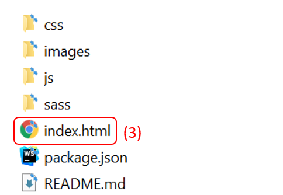

# NT_pochelib

## How to install
1. Click on the top right button "code" (1).
2. Choose "Download zip" (2).
3. On your computer, go to the folder dowloaded.
4. Unzip it and open the file "index.html" with your browser (3).

### Other options:
- clone the project
    1. Click on the file icon to the right of url (the adress is automatically copied) (4).
    2. Open your terminal and type "git clone url@github.com:yourFolder" (where "url" is the one you copied before and "yourFolder" the new folder created where you will have the content of the repository)
- Open with Github desktop (5).

## How to use 
Click on the button "Ajouter un livre" to display the search form, then enter the name of the author and the title to find the desired book.
You can add the book to your favourite list or removed it.

## Technologies used
- HTML/CSS
- JAVASCRIPT
- SASS.